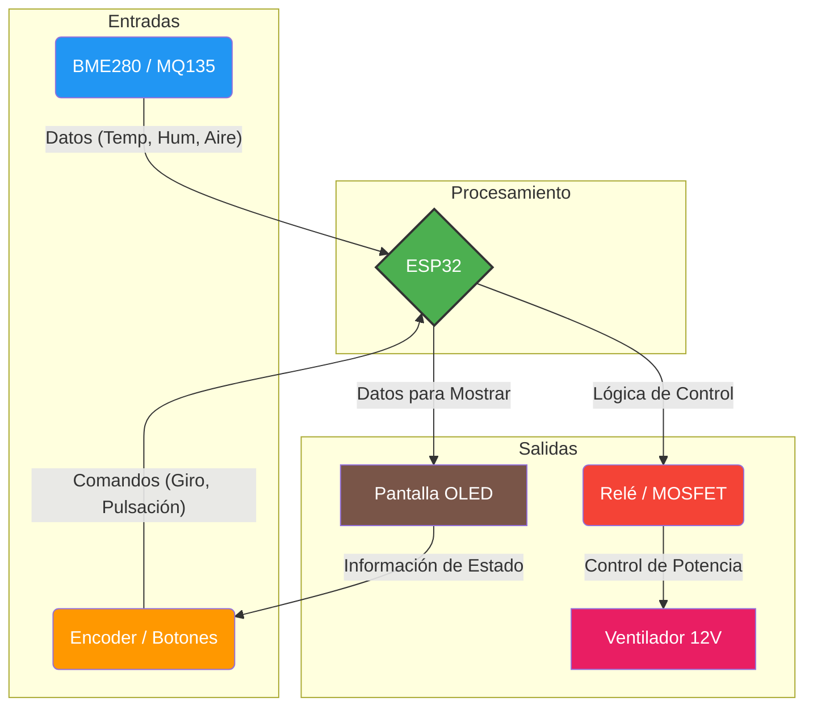

# Arquitectura del Sistema

Este diagrama muestra una vista de alto nivel de los componentes principales del sistema y cómo interactúan entre sí.

```mermaid
graph TD
    A[Sensores Ambientales] -- Datos (Temp, Hum, Aire) --> B{ESP32};
    C[Controles de Usuario] -- Comandos (Giro, Pulsación) --> B;
    B -- Lógica de Control --> D{Actuadores};
    D -- Control de Potencia --> E[Ventilador 12V];
    F[Pantalla OLED] -- Información de Estado --> C;
    B -- Datos para Mostrar --> F;

    subgraph "Entradas"
        A(BME280 / MQ135)
        C(Encoder / Botones)
    end

    subgraph "Procesamiento"
        B
    end

    subgraph "Salidas"
        D(Relé / MOSFET)
        E
        F
    end

    style A fill:#2196F3,color:#fff
    style C fill:#FF9800,color:#fff
    style D fill:#F44336,color:#fff
    style E fill:#E91E63,color:#fff
    style F fill:#795548,color:#fff
    style B fill:#4CAF50,stroke:#333,stroke-width:2px,color:#fff
```
