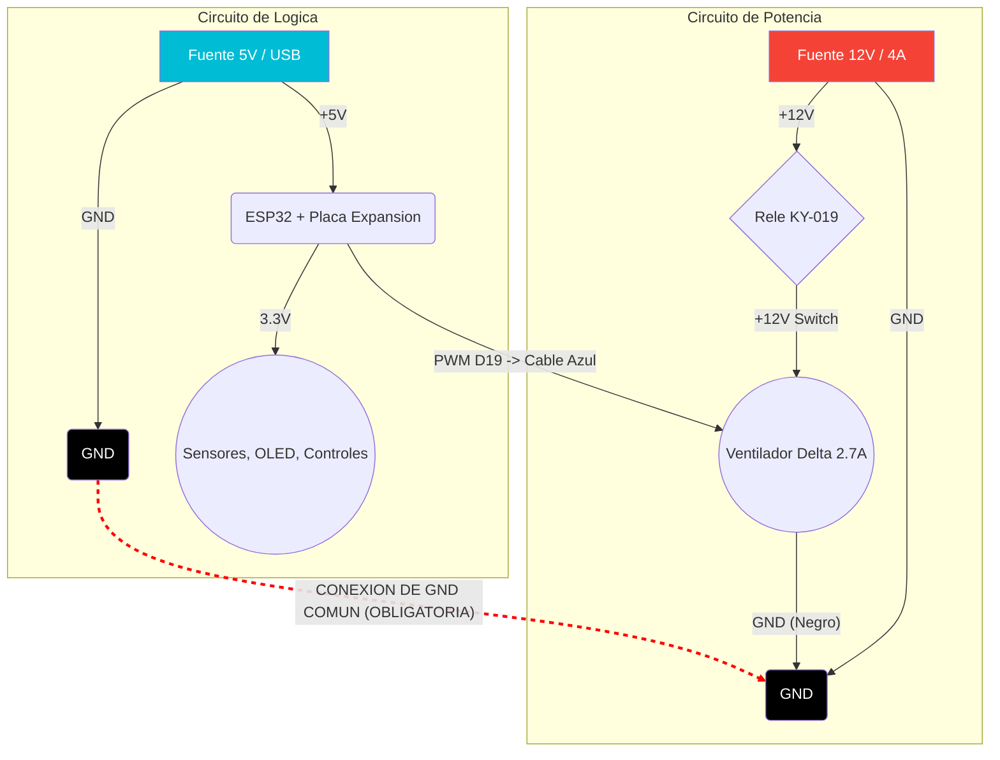

# Diagrama de Alimentación y GND Común - v7.1C FINAL

Este diagrama ilustra cómo se alimentan los circuitos de 5V (Lógica) y 12V (Potencia) y la importancia del GND común.

```mermaid
graph TD
    subgraph "Circuito de Logica"
        A[Fuente 5V / USB]
        A -- "+5V" --> B(ESP32 + Placa Expansion);
        A -- "GND" --> G1(GND);
        B -- "3.3V" --> C((Sensores, OLED, Controles));
    end

    subgraph "Circuito de Potencia"
        D[Fuente 12V / 4A]
        D -- "+12V" --> E{Rele KY-019};
        E -- "+12V Switch" --> F((Ventilador Delta 2.7A));
        D -- "GND" --> G2(GND);
        B -- "PWM D19 -> Cable Azul" --> F;
        F -- "GND (Negro)" --> G2;
    end

    %% Conexion Critica
    G1 -- "CONEXION DE GND COMUN (OBLIGATORIA)" --> G2;

    %% Estilos
    style A fill:#00BCD4,color:#fff
    style D fill:#F44336,color:#fff
    style G1 fill:#000,color:#fff
    style G2 fill:#000,color:#fff
    linkStyle 8 stroke:#ff0000,stroke-width:3px,stroke-dasharray: 5 5;
```
