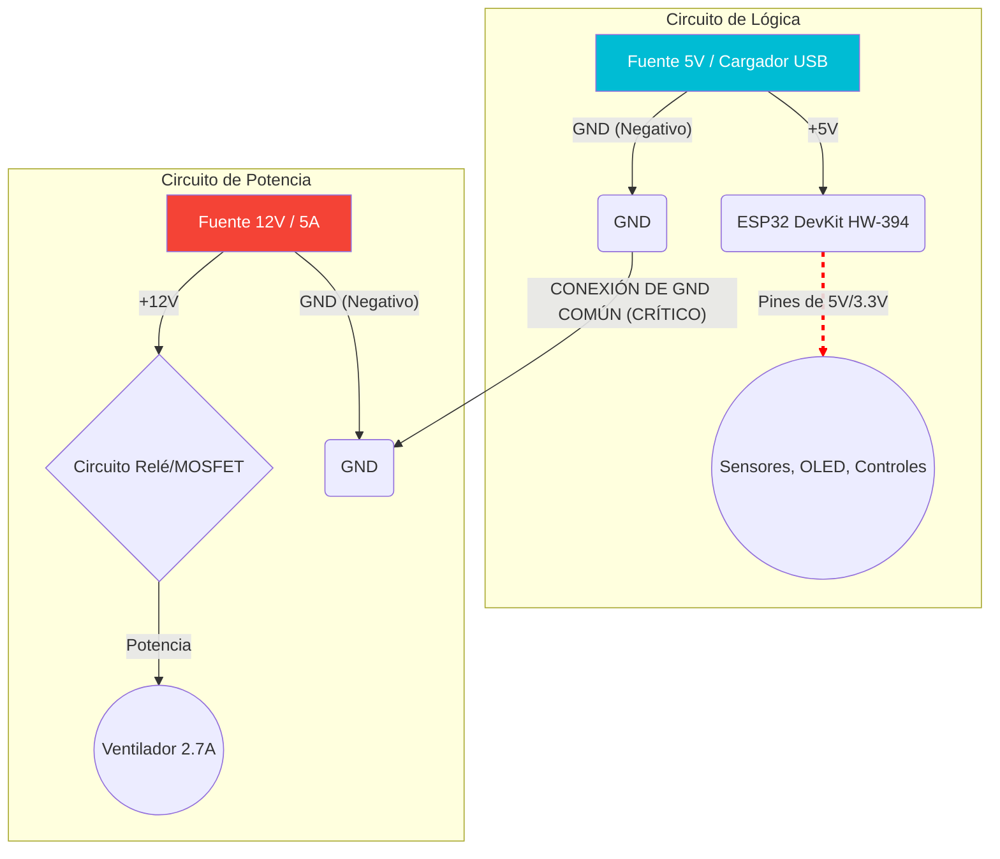

# Diagrama de Alimentación y GND Común

Este diagrama ilustra cómo se alimentan los dos circuitos del proyecto (5V y 12V) y cómo se establece la conexión crítica del GND común.

```mermaid
graph TD
    subgraph "Circuito de Lógica"
        A[Fuente 5V / Cargador USB]
        A -- "+5V" --> B(ESP32 DevKit HW-394);
        A -- "GND (Negativo)" --> G1(GND);
        B -- "Pines de 5V/3.3V" --> C((Sensores, OLED, Controles));
    end

    subgraph "Circuito de Potencia"
        D[Fuente 12V / 5A]
        D -- "+12V" --> E{Circuito Relé/MOSFET};
        E -- "Potencia" --> F((Ventilador 2.7A));
        D -- "GND (Negativo)" --> G2(GND);
    end

    %% Conexión Crítica
    G1 -- "CONEXIÓN DE GND COMÚN (CRÍTICO)" --> G2;

    %% Estilos
    style A fill:#00BCD4,color:#fff
    style D fill:#F44336,color:#fff
    linkStyle 2 stroke:#ff0000,stroke-width:3px,stroke-dasharray: 5 5;
```
