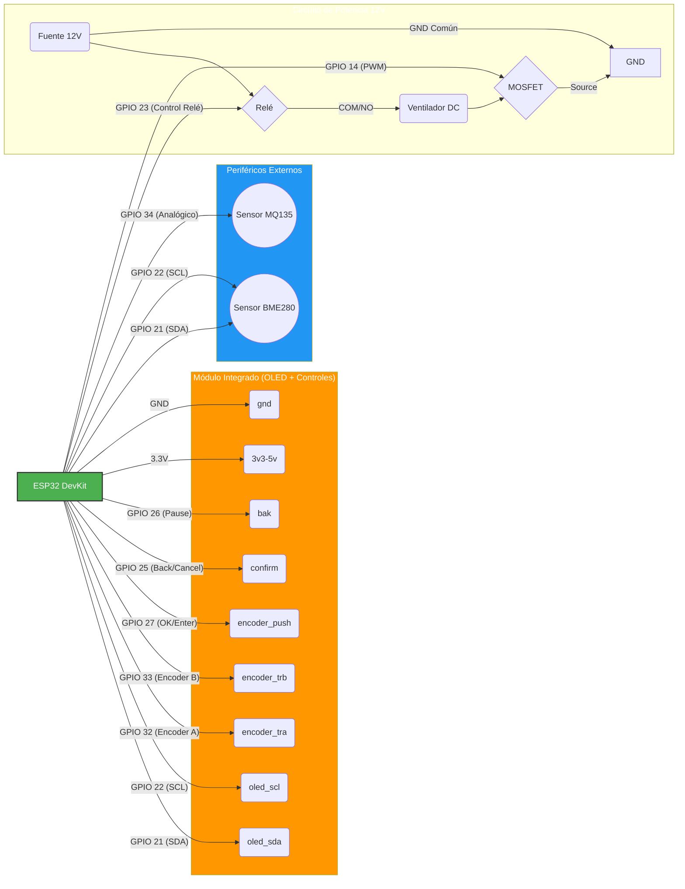

# Diagrama de Conexiones (Mermaid) - v6.0

Este diagrama muestra las conexiones lógicas para el firmware v6.0, con la nueva asignación de pines y lógica de botones.

```mermaid
graph LR
    subgraph perifericos["Periféricos Externos"]
        BME280((Sensor BME280))
        MQ135((Sensor MQ135))
    end

    subgraph modulo["Módulo Integrado (OLED + Controles)"]
        direction LR
        PinSDA(oled_sda)
        PinSCL(oled_scl)
        PinTRA(encoder_tra)
        PinTRB(encoder_trb)
        PinPush(encoder_push)
        PinConfirm(confirm)
        PinBak(bak)
        Pin3V(3v3-5v)
        PinGND(gnd)
    end

    subgraph potencia["Circuito de Potencia 12V"]
        Power12V(Fuente 12V) --> Relay{Relé};
        Relay -- COM/NO --> Fan(Ventilador DC);
        Fan --> MOSFET{MOSFET};
        MOSFET -- Source --> GND;
        Power12V -- "GND Común" --> GND;
    end

    ESP32[ESP32 DevKit]

    %% Conexiones al Módulo Integrado
    ESP32 -- "GPIO 21 (SDA)" --> PinSDA;
    ESP32 -- "GPIO 22 (SCL)" --> PinSCL;
    ESP32 -- "GPIO 32 (Encoder A)" --> PinTRA;
    ESP32 -- "GPIO 33 (Encoder B)" --> PinTRB;
    ESP32 -- "GPIO 27 (OK/Enter)" --> PinPush;
    ESP32 -- "GPIO 25 (Back/Cancel)" --> PinConfirm;
    ESP32 -- "GPIO 26 (Pause)" --> PinBak;
    ESP32 -- "3.3V" --> Pin3V;
    ESP32 -- "GND" --> PinGND;

    %% Conexiones a otros periféricos
    ESP32 -- "GPIO 21 (SDA)" --> BME280;
    ESP32 -- "GPIO 22 (SCL)" --> BME280;
    ESP32 -- "GPIO 34 (Analógico)" --> MQ135;
    
    %% Conexiones al circuito de potencia
    ESP32 -- "GPIO 23 (Control Relé)" --> Relay;
    ESP32 -- "GPIO 14 (PWM)" --> MOSFET;

    style ESP32 fill:#4CAF50,stroke:#333,stroke-width:2px,color:#fff
    style perifericos fill:#2196F3,color:#fff
    style modulo fill:#FF9800,color:#fff
    style potencia fill:#F4433G,color:#fff
```
