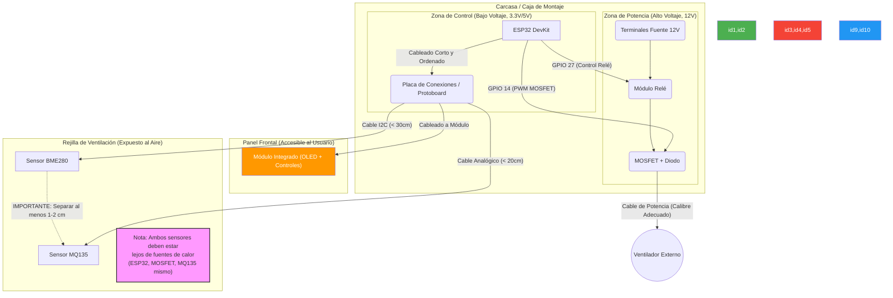

# Diagrama de Montaje Físico (Layout)

Este diagrama representa una disposición física sugerida para los componentes dentro de una carcasa, destacando la separación de zonas y las consideraciones de cableado.

