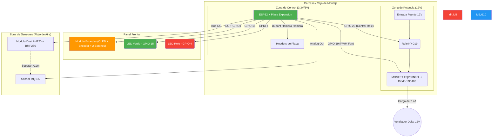

# Diagrama de Montaje Físico (Layout) - v6.6C

Disposición sugerida para los componentes dentro de la carcasa.

```mermaid
graph TD
    subgraph "Carcasa / Caja de Montaje"
        direction LR

        subgraph "Zona de Control (3.3V/5V)"
            id1[ESP32 + Placa Expansion]
            id1 -- "Dupont Hembra-Hembra" --> id2[Headers de Placa]
        end

        subgraph "Zona de Potencia (12V)"
            id3(Entrada Fuente 12V)
            id4(Rele KY-019)
            id5(MOSFET FQP30N06L + Diodo 1N5408)
            id3 --> id4 --> id5
        end

        %% Conexiones entre zonas
        id1 -- "GPIO 23 (Control Rele)" --> id4
        id1 -- "GPIO 19 (PWM Fan)" --> id5
    end

    subgraph "Panel Frontal"
        id6["Modulo Estardyn (OLED + Encoder + 2 Botones)"]
        idLEDG(LED Verde - GPIO 15)
        idLEDR(LED Rojo - GPIO 4)
    end

    subgraph "Zona de Sensores (Flujo de Aire)"
        id9[Modulo Dual AHT20 + BMP280]
        id10[Sensor MQ135]
        id9 -. "Separar >1cm" .-> id10
    end

    %% Conexiones
    id1 -- "I2C + GPIOs" --> id6
    id1 -- "GPIO 15" --> idLEDG
    id1 -- "GPIO 4" --> idLEDR
    id1 -- "Bus I2C" --> id9
    id1 -- "Analog Out" --> id10
    id5 -- "Carga de 2.7A" --> id11((Ventilador Delta 12V))

    %% Estilos
    style id1 fill:#4CAF50,color:#fff
    style id4,id5 fill:#F44336,color:#fff
    style id6 fill:#FF9800,color:#fff
    style id9,id10 fill:#2196F3,color:#fff
    style idLEDG fill:#4CAF50,color:#fff
    style idLEDR fill:#F44336,color:#fff
```
