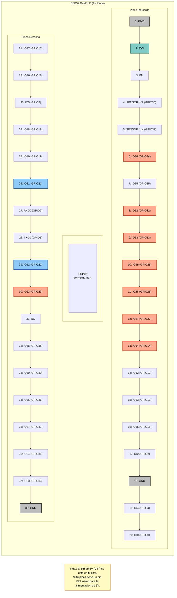

# Diagrama de Pines - ESP32 DevKit (WROOM-32D) - Layout Fiel a la Realidad

Este diagrama muestra la disposición de los 38 pines de tu placa, imitando su apariencia física con dos columnas enfrentadas.

**Los pines utilizados en el proyecto "Extractor Inteligente v6.1" están resaltados en color.**

### Leyenda de Colores
- **Naranja**: Pines de control y sensores (GPIO).
- **Azul**: Pines del bus de comunicación I2C.
- **Verde**: Pines de alimentación (3.3V / 5V).
- **Gris**: Pines de tierra (GND).
- **Amarillo**: Nota importante.
