# Diagrama de Pines - ESP32 DevKit (WROOM-32D) - Tu Placa

Este diagrama muestra la disposición de los 38 pines de tu placa de desarrollo ESP32 DevKit C, con la numeración y el orden exacto que has proporcionado.

**Los pines utilizados en el proyecto "Extractor Inteligente v6.1" están resaltados en color.**

```mermaid
graph TD
    subgraph "ESP32 DevKit C (Vista Superior)"
        direction LR

        subgraph "Pines Izquierda (1-20)"
            direction TB
            P1["1: GND"]
            P2["2: 3V3"]
            P3["3: EN"]
            P4["4: SENSOR_VP (GPIO36)"]
            P5["5: SENSOR_VN (GPIO39)"]
            P6["6: IO34 (GPIO34)"]
            P7["7: IO35 (GPIO35)"]
            P8["8: IO32 (GPIO32)"]
            P9["9: IO33 (GPIO33)"]
            P10["10: IO25 (GPIO25)"]
            P11["11: IO26 (GPIO26)"]
            P12["12: IO27 (GPIO27)"]
            P13["13: IO14 (GPIO14)"]
            P14["14: IO12 (GPIO12)"]
            P15["15: IO13 (GPIO13)"]
            P16["16: IO15 (GPIO15)"]
            P17["17: IO2 (GPIO2)"]
            P18["18: GND"]
            P19["19: IO4 (GPIO4)"]
            P20["20: IO0 (GPIO0)"]
        end

        subgraph " "
           direction TB
           ESP["<br/><br/><br/><br/><br/><br/><b>ESP32</b><br/>WROOM-32D<br/><br/><br/><br/><br/><br/><br/><br/>"]
        end

        subgraph "Pines Derecha (21-38)"
            direction TB
            P21["21: IO17 (GPIO17)"]
            P22["22: IO16 (GPIO16)"]
            P23["23: IO5 (GPIO5)"]
            P24["24: IO18 (GPIO18)"]
            P25["25: IO19 (GPIO19)"]
            P26["26: IO21 (GPIO21)"]
            P27["27: RXD0 (GPIO3)"]
            P28["28: TXD0 (GPIO1)"]
            P29["29: IO22 (GPIO22)"]
            P30["30: IO23 (GPIO23)"]
            P31["31: NC"]
            P32["32: IO38 (GPIO38)"]
            P33["33: IO39 (GPIO39)"]
            P34["34: IO36 (GPIO36)"]
            P35["35: IO37 (GPIO37)"]
            P36["36: IO34 (GPIO34)"]
            P37["37: IO33 (GPIO33)"]
            P38["38: GND"]
        end
    end

    %% --- Conexiones del Proyecto ---
    P6 --- MQ135["<-- (AOUT) Sensor MQ135"]
    P8 --- EncA["<-- (TRA) Encoder A"]
    P9 --- EncB["<-- (TRB) Encoder B"]
    P10 --- BtnBack["<-- (confirm) Botón Back/Cancel"]
    P11 --- BtnPause["<-- (bak) Botón Pausa"]
    P12 --- BtnOK["<-- (push) Botón OK/Enter"]
    P13 --- PWM["<-- (Gate) MOSFET PWM"]
    P2 --- VCC3V["<-- Alimentación 3.3V"]
    P1 --- GND_L1["<-- Tierra Común"]
    P18 --- GND_L18["<-- Tierra Común"]
    P38 --- GND_R38["<-- Tierra Común"]
    
    P26 --- SDA["(SDA) I2C Bus -->"]
    P29 --- SCL["(SCL) I2C Bus -->"]
    P30 --- Relay["Control Relé -->"]
    
    %% Asumiendo 5V es el pin VIN, que no está explícitamente numerado en tu diagrama.
    %% Si tu placa tiene un pin VIN de 5V, conéctalo a este nodo.
    VIN_5V["5V (VIN)"]
    style VIN_5V fill:#80CBC4,stroke:#004D40,stroke-width:1px,color:black

    %% --- Estilos de los Pines Usados ---
    style P6 fill:#FFAB91,stroke:#BF360C,stroke-width:2px,color:black
    style P8 fill:#FFAB91,stroke:#BF360C,stroke-width:2px,color:black
    style P9 fill:#FFAB91,stroke:#BF360C,stroke-width:2px,color:black
    style P10 fill:#FFAB91,stroke:#BF360C,stroke-width:2px,color:black
    style P11 fill:#FFAB91,stroke:#BF360C,stroke-width:2px,color:black
    style P12 fill:#FFAB91,stroke:#BF360C,stroke-width:2px,color:black
    style P13 fill:#FFAB91,stroke:#BF360C,stroke-width:2px,color:black
    style P2 fill:#80CBC4,stroke:#004D40,stroke-width:2px,color:black
    style P1 fill:#BDBDBD,stroke:#212121,stroke-width:2px,color:black
    style P18 fill:#BDBDBD,stroke:#212121,stroke-width:2px,color:black
    style P38 fill:#BDBDBD,stroke:#212121,stroke-width:2px,color:black
    
    style P26 fill:#90CAF9,stroke:#0D47A1,stroke-width:2px,color:black
    style P29 fill:#90CAF9,stroke:#0D47A1,stroke-width:2px,color:black
    style P30 fill:#FFAB91,stroke:#BF360C,stroke-width:2px,color:black
    
    %% --- Estilos de las Etiquetas ---
    style MQ135 fill:#FFAB91,stroke:#BF360C,stroke-width:1px,color:black
    style EncA fill:#FFAB91,stroke:#BF360C,stroke-width:1px,color:black
    style EncB fill:#FFAB91,stroke:#BF360C,stroke-width:1px,color:black
    style BtnBack fill:#FFAB91,stroke:#BF360C,stroke-width:1px,color:black
    style BtnPause fill:#FFAB91,stroke:#BF360C,stroke-width:1px,color:black
    style BtnOK fill:#FFAB91,stroke:#BF360C,stroke-width:1px,color:black
    style PWM fill:#FFAB91,stroke:#BF360C,stroke-width:1px,color:black
    style VCC3V fill:#80CBC4,stroke:#004D40,stroke-width:1px,color:black
    style GND_L1 fill:#BDBDBD,stroke:#212121,stroke-width:1px,color:black
    style GND_L18 fill:#BDBDBD,stroke:#212121,stroke-width:1px,color:black
    style GND_R38 fill:#BDBDBD,stroke:#212121,stroke-width:1px,color:black
    style SDA fill:#90CAF9,stroke:#0D47A1,stroke-width:1px,color:black
    style SCL fill:#90CAF9,stroke:#0D47A1,stroke-width:1px,color:black
    style Relay fill:#FFAB91,stroke:#BF360C,stroke-width:1px,color:black

```

### Leyenda de Colores
- **Naranja**: Pines de control y sensores (GPIO).
- **Azul**: Pines del bus de comunicación I2C.
- **Verde**: Pines de alimentación (3.3V / 5V).
- **Gris**: Pines de tierra (GND).
