# Diagrama de Pines · ESP32 DevKit HW-394 (USB-C, 30 pines)

Este diagrama replica la distribución física de la placa **ESP32 DevKit HW-394** (también conocida como "ESP32 Type-C 5V"), con el conector USB hacia arriba y 15 pines por lado. Incluye la numeración serigrafiada y los pines lógicos (GPIO) para facilitar el cableado del proyecto.

**Los pines utilizados en el proyecto "Extractor Inteligente v6.1" aparecen resaltados.**

```mermaid
graph LR
    subgraph "ESP32 DevKit HW-394"
        direction TB

        subgraph "Lado Izquierdo (pines 1-15)"
            direction TB
            I1["1 · 3V3"]
            I2["2 · GND"]
            I3["3 · D15 (GPIO15)"]
            I4["4 · D2 (GPIO2)"]
            I5["5 · D4 (GPIO4)"]
            I6["6 · D16 (GPIO16)"]
            I7["7 · D17 (GPIO17)"]
            I8["8 · D5 (GPIO5)"]
            I9["9 · D18 (GPIO18)"]
            I10["10 · D19 (GPIO19)"]
            I11["11 · D21 (GPIO21)"]
            I12["12 · RX0 (GPIO3)"]
            I13["13 · TX0 (GPIO1)"]
            I14["14 · D22 (GPIO22)"]
            I15["15 · D23 (GPIO23)"]
        end

        subgraph " "
            direction TB
            M["<br/><br/><br/><br/><b>ESP32</b><br/>WROOM-32<br/>HW-394<br/><br/><br/><br/><br/>"]
        end

        subgraph "Lado Derecho (pines 16-30)"
            direction TB
            R1["16 · VIN (5V)"]
            R2["17 · GND"]
            R3["18 · D13 (GPIO13)"]
            R4["19 · D12 (GPIO12)"]
            R5["20 · D14 (GPIO14)"]
            R6["21 · D27 (GPIO27)"]
            R7["22 · D26 (GPIO26)"]
            R8["23 · D25 (GPIO25)"]
            R9["24 · D33 (GPIO33)"]
            R10["25 · D32 (GPIO32)"]
            R11["26 · D35 (GPIO35)"]
            R12["27 · D34 (GPIO34)"]
            R13["28 · VN (GPIO39)"]
            R14["29 · VP (GPIO36)"]
            R15["30 · EN"]
        end
    end

    %% Pines del proyecto
    I1 --- VCC3V["← 3.3V lógica"]
    I2 --- GND_I2["← GND (común)"]
    I11 --- SDA["← SDA (OLED + BME280)"]
    I14 --- SCL["← SCL (OLED + BME280)"]
    I15 --- Relay["← IN Relé (GPIO23)"]

    R1 --- VCC5V["5V/VIN → (Relé + MQ135)"]
    R2 --- GND_R2["GND → (Común)"]
    R5 --- PWM["PWM Ventilador → MOSFET"]
    R6 --- BtnOK["OK / Enter → encoder_push"]
    R7 --- BtnPause["Pausa → bak"]
    R8 --- BtnBack["Back / Cancel → confirm"]
    R9 --- EncB["Encoder B → encoder_trb"]
    R10 --- EncA["Encoder A → encoder_tra"]
    R12 --- MQ135["Analógico MQ135 → AOUT"]

    %% Estilos destacados
    style I1 fill:#80CBC4,stroke:#004D40,stroke-width:2px,color:black
    style I2 fill:#BDBDBD,stroke:#212121,stroke-width:2px,color:black
    style I11 fill:#90CAF9,stroke:#0D47A1,stroke-width:2px,color:black
    style I14 fill:#90CAF9,stroke:#0D47A1,stroke-width:2px,color:black
    style I15 fill:#FFAB91,stroke:#BF360C,stroke-width:2px,color:black

    style R1 fill:#80CBC4,stroke:#004D40,stroke-width:2px,color:black
    style R2 fill:#BDBDBD,stroke:#212121,stroke-width:2px,color:black
    style R5 fill:#FFAB91,stroke:#BF360C,stroke-width:2px,color:black
    style R6 fill:#FFAB91,stroke:#BF360C,stroke-width:2px,color:black
    style R7 fill:#FFAB91,stroke:#BF360C,stroke-width:2px,color:black
    style R8 fill:#FFAB91,stroke:#BF360C,stroke-width:2px,color:black
    style R9 fill:#FFAB91,stroke:#BF360C,stroke-width:2px,color:black
    style R10 fill:#FFAB91,stroke:#BF360C,stroke-width:2px,color:black
    style R12 fill:#FFAB91,stroke:#BF360C,stroke-width:2px,color:black

    style VCC3V fill:#80CBC4,stroke:#004D40,stroke-width:1px,color:black
    style GND_I2 fill:#BDBDBD,stroke:#212121,stroke-width:1px,color:black
    style SDA fill:#90CAF9,stroke:#0D47A1,stroke-width:1px,color:black
    style SCL fill:#90CAF9,stroke:#0D47A1,stroke-width:1px,color:black
    style Relay fill:#FFAB91,stroke:#BF360C,stroke-width:1px,color:black

    style VCC5V fill:#80CBC4,stroke:#004D40,stroke-width:1px,color:black
    style GND_R2 fill:#BDBDBD,stroke:#212121,stroke-width:1px,color:black
    style PWM fill:#FFAB91,stroke:#BF360C,stroke-width:1px,color:black
    style BtnOK fill:#FFAB91,stroke:#BF360C,stroke-width:1px,color:black
    style BtnPause fill:#FFAB91,stroke:#BF360C,stroke-width:1px,color:black
    style BtnBack fill:#FFAB91,stroke:#BF360C,stroke-width:1px,color:black
    style EncB fill:#FFAB91,stroke:#BF360C,stroke-width:1px,color:black
    style EncA fill:#FFAB91,stroke:#BF360C,stroke-width:1px,color:black
    style MQ135 fill:#FFAB91,stroke:#BF360C,stroke-width:1px,color:black
```

## Tabla de referencia rápida

| GPIO | Pin físico | Serigrafía | Uso en el proyecto |
|------|------------|------------|--------------------|
| 21   | 11         | D21        | SDA (OLED + BME280) |
| 22   | 14         | D22        | SCL (OLED + BME280) |
| 32   | 25         | D32        | Encoder A (`encoder_tra`) |
| 33   | 24         | D33        | Encoder B (`encoder_trb`) |
| 27   | 21         | D27        | Botón OK (`encoder_push`) |
| 25   | 23         | D25        | Botón Back (`confirm`) |
| 26   | 22         | D26        | Botón Pausa (`bak`) |
| 34   | 27         | D34        | Entrada analógica MQ135 |
| 23   | 15         | D23        | Control del relé (HIGH = activa) |
| 14   | 20         | D14        | PWM al MOSFET del ventilador |
| 3V3  | 1          | 3V3        | Alimentación lógica sensores/controles |
| VIN  | 16         | VIN        | Alimentación 5V para relé y MQ135 |
| GND  | 2 / 17     | GND        | Tierra común del sistema |

> 🔎 **Tip**: La placa permite alimentar el proyecto tanto por USB-C como por el pin VIN (5V). Siempre une los GND de todos los módulos para evitar lecturas erróneas.
