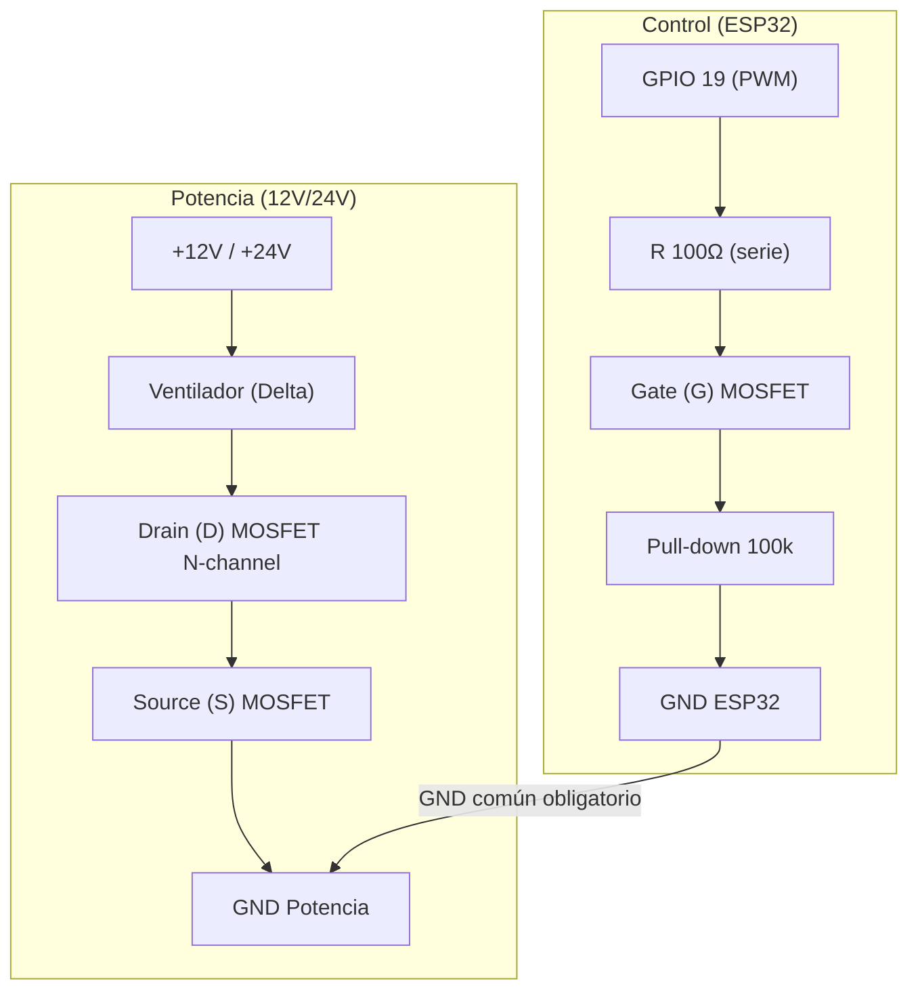

# ✅ Esquema visual de montaje del MOSFET (low‑side)

Este esquema muestra el montaje recomendado para el MOSFET como interruptor de bajo lado, con PWM desde el ESP32.

## Conexiones clave (resumen)
- **+V (12V/24V)** directo al ventilador.
- **Retorno del ventilador** al **Drain** del MOSFET.
- **Source** del MOSFET a **GND**.
- **Gate** desde **GPIO 19 (PWM)** con **R 100Ω** en serie.
- **Pull‑down 100k** a GND para apagar al inicio.
- **GND común** entre fuente de potencia y ESP32.
